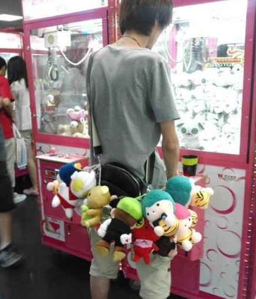
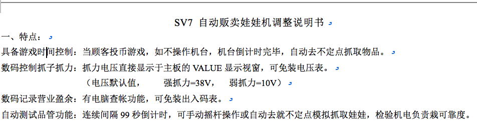
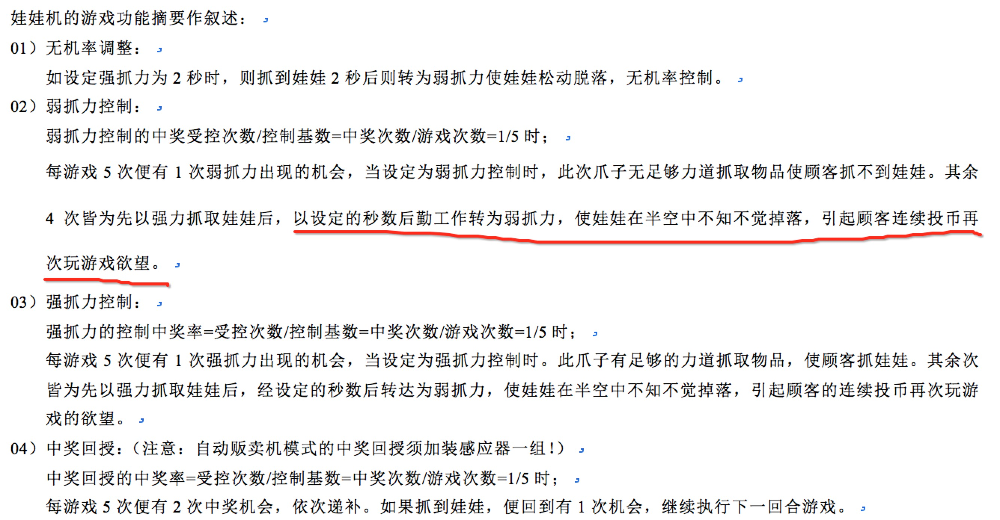
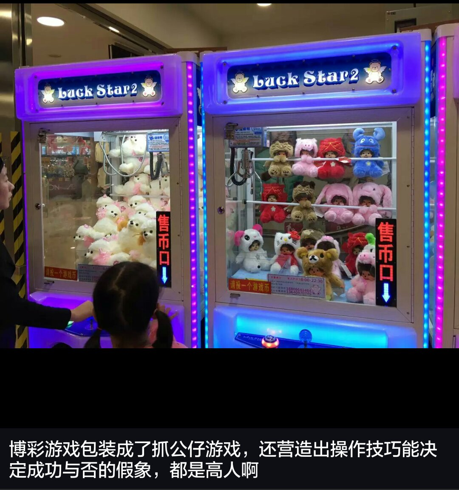

每次路过抓娃娃机，都会被里面的好东西吸引，不少妹子更是对娃娃没有抵抗力，用充满期待的大眼睛看着旁边的GG，GG们一看，一块钱一次，开心的笑了，看我的抓娃娃神功。
<!--more-->
接下来这一幕是不是特别熟悉

然后我们深陷其中无法自拔，疯狂找寻攻略和技巧，下定决心苦练技术

力求达到如下境界，并抱得美人归：

那么问题来了。
对这种满大街都有的娃娃机，我的看法是，它首先是商家花钱购买的机器，唯一的目的是为了赚钱。
如果真的可以通过某种技巧来抓娃娃，一抓一个准，哪里还会有商家会花钱来承受这样的风险呢？

为了验证我的想法，我特地从网上找了一份自动贩卖娃娃机调整说明书

里面详细说明了对娃娃机游戏功能的调整模式

这下大家都明白了吧？你是否能抓到娃娃的概率，完全是由商家控制的。你只是一个触发抓娃娃行为的发起者和投币人。而且我可以向你保证，你抓到娃娃的平均成本一定高于娃娃的成本。

有一位前辈对抓娃娃机的点评真是一针见血：

如果带着“天下熙熙,皆为利来;天下攘攘,皆为利往”的看法去看世界，你会发现很多这样的例子，特别是游戏厅，比如一直流行的水果机、最近比较火的捕鱼游戏等等。

我读小学的时候长期泡游戏厅，有一段时间着迷着水果机，当时1块钱买4个游戏币，水果机的中奖率从5到100，也就是说，只要中了，最少都可以一个游戏币变5个游戏币，有一段时间我站在水果机旁边背诵着中奖的结果，试图找出中奖规律。然后梦想着以后打游戏机不花钱并为自己的这个目标而激动不已。
现在想起来，其实游戏厅老板每隔2个小时，拿着钥匙打开水果机，拿走大量“收获”的游戏币的时候，我就应该知道这是一个必输局。

不知道为什么会有这么多人看不开，败光了自己的财产，最后却觉得只是运气不好。
我想，可能是心里的一个贪念，妄想不劳而获。
而很多骗子就是利用了这一点，一般套路都是给你一个以小博大，用小钱赚大钱的机会，机会“看起来”越大就越受欢迎。
类似的例子还可以引申到很多地方，比如赌博，六合彩等等。

所以以后遇到类似的东西，不妨从这个角度来看问题。自己不贪，就不容易受骗。

ps： 文章的排版挺不好看的，我想我可能需要学习一下markdown的格式。