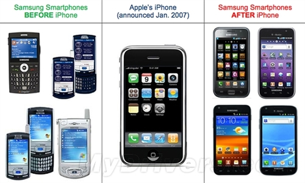
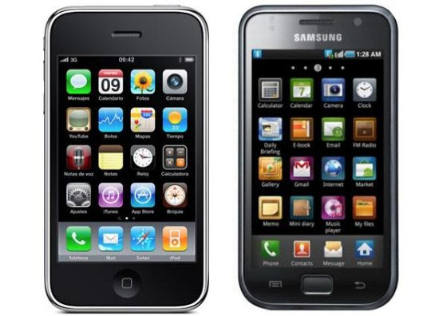
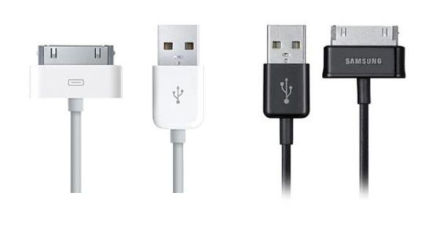
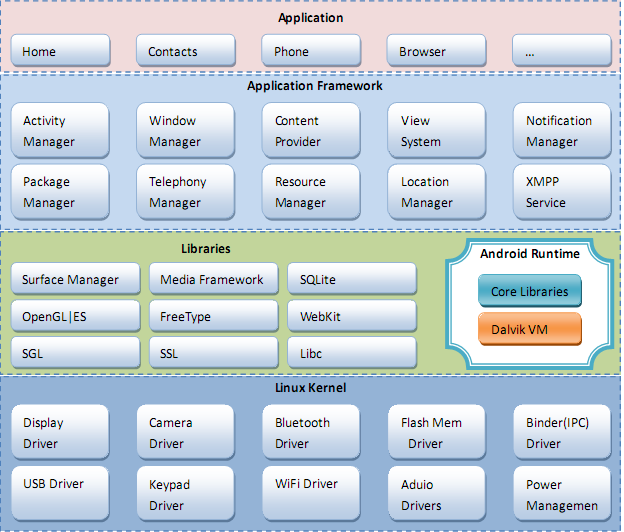
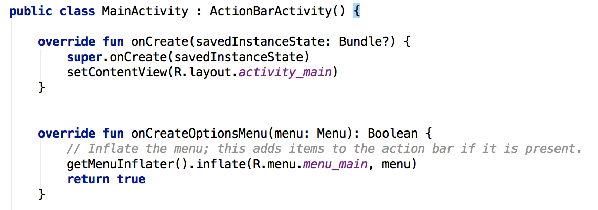
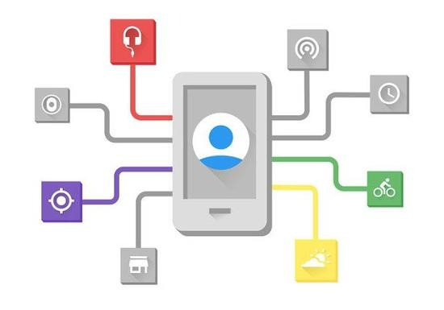

懒癌发作好久没更新了，最近得空想放个大招，写写自己的老本行，天马行空的介绍下安卓的发展历程和历史。

总结下，我想讲如下几个方面：
- Android之父
- Google为什么收购Android
- 发展历程
- Android为什么会火
- 免费的怎么赚钱
- 专利战
- 历史版本
- 关于抄袭
- 架构
- 技术发展现状
- 趋势

好像一下写太多，有些题目又太大了。--！

<!--more-->

## Android之父
Andy Rubin


Andy是一个典型的Geek，1963年出生于美国纽约，在他53年的极客人生中，他一直致力于将最酷、最超越时代的电子产品呈现给世人。
从网络电视，到数码相机，到智能手机，到各式机器人，从苹果到微软再到现在的谷歌，鲁宾总是在最酷的公司做着最酷的研究。

Andy先后在卡尔·蔡司、苹果、微软等知名公司工作，后来成立了Danger和Android两家公司。

担任Danger公司CEO期间，由于运营不理想，被迫辞职。随后，Andy跑到自己的老度假福地开曼群岛待了几个月，并在那里开始编写软件，试图研制一款数码相机的操作系统。但老问题又来了，没人肯投资这款相机。兜兜转转，Andy又回到了研制智能手机操作系统上。

Andy把所有的积蓄都倾注在Android项目上。但还是遇到了缺钱的问题。很快，有风险资本家对Android的开发项目感兴趣，提出收购Android。但是Andy主动跟Google创始人Page发邮件，暗示Android也存在跟谷歌合作的可能性。

几周后，也就是2005年8月，Google以五千万美元的价格收购了名不见经传的Android。Andy成为谷歌公司的工程部副总裁，继续负责Android项目。

## Google为什么收购Android？

战略收购。

Google擅长于网络，但是在移动端硬件和操作系统的积累较少。Google似乎预感到移动互联网的趋势，为了抢夺移动终端入口，收购了Android。

原因：Android系统中可以无缝整合谷歌的各种服务和软件，加上开源带来的各种应用的丰富、繁荣，谷歌可以与应用开发者合作，借助谷歌的广告技术让大家实现共赢，形成良好的生态圈。


<center>**互联网设备份额**</center>

此时天时地利，郎有情妾有意，Andy发给Page的邮件无意间促成了收购，这笔收购在现在看来，堪称Google最成功的收购。

## 发展历程

Android在2005年被收购之后，花完了资金，陷入不温不火的尴尬境地。

正当Andy为未来悲观时，苹果拯救了Android。- -！，是的，你没有看错。
2007年，乔布斯发布第一款iPhone。全新的理念和无比友好的界面，立即震撼市场。
Google意识到这小小的掌上机隐含的威胁，然后翻开自己的“收购抽屉”，找到了Android来对抗iPhone。

很快，Google以免费提供Android操作系统为诱饵，联合灰头土脸的手机生产商们对抗苹果。
从此，Android开始腾飞。


<center>**移动操作系统份额**</center>

## 为什么Android会火？

好的操盘手Google，为了尽快建起防线，对抗苹果，抢占手机市场。为Android量身定做的几个战略方向：
- 开放：建立[开放手持设备联盟](https://zh.wikipedia.org/wiki/%E9%96%8B%E6%94%BE%E6%89%8B%E6%A9%9F%E8%81%AF%E7%9B%9F)，联合全世界手机厂商对抗苹果，手机厂商挤不进苹果封闭的系统，也只能搭Android这条船。
- 免费：所有人均可以免费获取Android操作系统的授权
- 开源：开放源码，可以做OEM深度定制和适配
- 廉价：Android主要支持ARM架构的芯片。这一架构以精简节能著称。
- 快：Linux、Java
    - 在ARM上层，Android使用Linux内核，从而利用Linux丰富的硬件支持，快速适配终端
    - 在Linux内核之上，Android使用跨平台和被广泛使用的Java来开发应用程序，从而快速开发应用程序
    
基于以上原因，相比于iPhone长达数年的酝酿，Android不到一年即发布产品！！！
但是这种“四处借鉴”的做法也为未来的专利之争埋下祸根。

对此，本人感受颇深，我从大学毕业后，去了oppo从事Feature Phone的开发，随着iPhone的发布，公司强烈感受到了智能机普及的趋势，其实公司早几年就开始从事智能手机的预研，有试过Windows Mobile，Linux，各种坑。种种原因没办法量产。
而安卓的问世，真好比雪中送炭。当时看来，Android无疑是最合适的智能手机系统。我也随大流开始转型学习java和Android系统，从事Android手机系统的研发。

Android火了，也带动了对Android开发工程师的需求，Android工程师的薪资也水涨船高，由此可见，我们在埋头写代码的同时，也要抽时间了解下发展趋势，要能跟上软件发现潮流。

## 免费的怎么赚钱？

免费的产品、服务就不赚钱？看到这句话，奇虎360看着自己高达100亿美元市值就偷偷地笑了。
据外媒报道，谷歌Android操作系统已经创造了310亿美元营收，220亿美元利润，利润率达70%！

那么问题来了，完全开源免费的安卓系统，到底从哪捞钱的呢？

- 广告！
对于谷歌来说，其搜索、邮件等核心业务虽然并没有直接赚钱，但它们毫无疑问是谷歌广告生态的坚实基础。安卓系统也是如此，它在谷歌移动广告的最佳载体，是谷歌在移动市场不可或缺的一部分。

- Google Play
2015年，GooglePlay的下载量比苹果AppStore高出100%，2014年则是高出60%。也就是说，去年Google Play不仅仅体量更大，增速也要快于App Store。
当然，限于安卓应用的质量一般比不上iOS应用，且苹果设备用户更舍得消费，因此App Store的收入比Google Play多75%。

## 专利战

- 苹果：
    Android在移动市场的强势崛起威胁到了苹果的霸主地位。在无法以技术创新拉开距离的前提下，苹果开始动用专利武器，对Android、HTC、三星提起诉讼。

    然而乔布斯手中的两百多项专利，并不能真正击败Android。通过一些小的改动，比如将横向滑动的解锁改为不定向的滑动，Android就可以避开专利陷阱。而三星甚至因为苹果的诉讼，提高了在美国市场的知名度。

    PS：专利大战后，一种特殊人才火了，那就是即懂Android又懂专利的工程师。

    然而，Google自己也没有预期到Android的成功，暗自后悔最初太保守。三星在Android阵营中的一家独大也让Google心生警惕。Google花大价钱收购了摩托罗拉，打造自己的硬件生产线，更获得了摩托罗拉的大量专利，用来对抗专利战。

- Oracle：
    从Sun手中买过Java后，Oracle还没有从Java中获得太大的利益。而Oracle手中的Java，也发展缓慢。然而这并不妨碍Oracle对Android的觊觎。
    Oracle对Google提起诉讼，索赔93亿美金，相对于此，Oracle收购Sun的56亿美元，显得便宜得多。

    其诉讼理由是“Google对Java API的改动，破坏了Java平台的完整性”。听起来有些空洞，却支撑起百亿美元的专利案。

    Android为开发基于Java语言的App应用提供的API接口分为两部分，一部分是代码库的 API 接口，另一部分是 Google 开发的可以让该代码库工作的实现代码。Java 的开发者 Oracle 自己提供了两种实现代码库的方式，一种是自有版权的 JDK 版本，另一种是开源的 OpenJDK 版本。OpenJDK 之前就在 Android 的某些方面得到应用，现在将投入更多精力到 OpenJDK。

## 历史版本

- 2008年9月23日 Android 1.0（Astro）
    主要特性：
        Android Market
        各种App：相机、浏览器、Email、联系人、地图、多媒体播放器等
        支持Wifi和蓝牙等
        等等

- 2009年4月17日 Android 1.5（Cupcake）
    主要特性：
        播放视频
        浏览器支持WebKet
        支持手机旋转
        应用程序UI大幅改进等
        等等

- 2009年9月15日 Android 1.6（Donut）
    主要特性：
        手势支持
        支持CDMA网络
        支持更多屏幕分辨率等
        等等

- 2009年10月26日 Android 2.0/2.1（Eclair）
    主要特性：
        改良UI
        优化硬件速度
        全新的APP更新
        支持动态桌面设计
        等等

- 2010年5月20日  Android 2.2（Froyo）
    主要特性：
        支持内存卡
        加快软件即时编译的速度
        WIFI热点及USB分析器
        速度和性能优化
        等等

- 2010年12月7日  Android 2.3（Gingerbread）
    主要特性：
        系统级粘贴复制
        重新设计的多点触摸屏幕键盘
        支持NFC、陀螺仪、气压计
        改善电池耗电量，增加续航时间
        下载和屏幕截图等功能
        等等

- 2011年2月2日   Android 3.0（Honeycomb）
    主要特性：
        仅供平板电脑使用
        3D加速处理
        UI改进
        等等

- 2011年5月11日  Android 3.1（Honeycomb）
- 2011年7月13日  Android 3.2（Honeycomb）
        
- 2011年10月19日 Android 4.0（Ice Cream Sandwich）
    主要特性：
        统一了手机和平板电脑使用的系统，应用会自动根据设备选择最佳显示方式
        提升硬件的性能以及系统的优化，提升系统流畅度
        支持在系统中使用虚拟按键，该功能可以取代物理按键
        更好的语音集成，实时录音，文本听写等语音功能
        脸部识别进行锁屏，可以通过脸部识别进行锁屏
        增加支持硬件加速的功能
        等等

- 2012年6月28日  Android 4.1（Jelly Bean）
    主要特性：
        修复Android 4.0中的Bug
        “黄油”性能（Project Butter）
        通知中心显示更多消息
        等等

- 2012年10月30日 Android 4.2（Jelly Bean）
    主要特性：
        手势输入键盘
        改进锁屏：支持Widget，可于屏幕锁定界面直接打开相机功能。
        可直接进行操作的状态通知列功能
        连点三次可放大整个显示页及两指旋转和缩放
        增加为盲人用户设计的语音输出及手势模式导航功能
        内置时钟新增世界时钟，秒表和定时器
        Google Now新增以Gmail登录信息作为数据源
        Google Now新增航班追踪功能、酒店、餐厅预订，与音乐和电影推荐功能。
        Gmail邮件可缩放显示
        等等

- 2013年7月25日  Android 4.3（Jelly Bean）
    主要特性：
        支持多用户登录，支持一台终端设备上有多个登录帐号。
        “蓝牙低功耗”功能，开启蓝牙后，耗电量相比之前大幅降低。
        支持更多缓冲器对象
        新版OpenGL ES 3.0着色语言，支持32 位整数和浮点数据类型以及操作。
        增加多个纹理的支持，包括浮点纹理、深度纹理、顶点纹理等等。
        多重渲染目标，让GPU一次性渲染多个纹理。
        多重采样抗锯齿，让3D物体的边缘不出现毛刺，可提升图像效果。
        使用统一的纹理压缩格式ETC
        增加TRIM指令，使得内置存储（Internal Storage）不会越用越慢。
        新增App Opt功能（默认隐藏），允许用户强行解除已安装应用的特定权限。
        等等

- 2013年11月1日  Android 4.4（KitKat）
    主要特性：
        支持语音打开Google Now (在主画面说出“OK Google”)
        在阅读电子书、玩游戏、看电影时支持全屏模式（Immersive Mode）
        优化存储器使用，在多任务处理时有更佳工作的表现。
        新的电话通信功能
        旧有的SMS应用程序集成至新版本的Hangouts应用程序
        Emoji Keyboard 集成至Google本地的键盘
        支持Google Cloud Print服务，让用户可以利用户中或办公室中连接至Cloud Print的打印机，印出文件。
        支持第三方Office应用程序直接打开及存储用户在Google Drive内的文件，实时同步更新文件。
        支持低电耗音乐播放
        全新的原生计步器
        全新的NFC付费集成
        全新的非Java虚拟机运行环境ART（Android Runtime）
        支持Message Access Profile（MAP）
        支持Chromecast及新的Chrome功能
        支持隐闭字幕
        等等

- 2014年10月16日 Android 5.0（Lollipop）
    主要特性：
        采用全新Material Design界面
        支持64位处理器
        全面由Dalvik转用ART(Android Runtime)编译，性能可提升四倍
        改良的通知界面及新增优先模式
        预载省电及充电预测功能
        新增自动内容加密功能
        新增多人设备分享功能，可在其他设备登录自己账号，并获取用户的联系人、日历等Google云数据
        强化网络及传输连接性，包括Wi-Fi、蓝牙及NFC
        强化多媒体功能，例如支持RAW格式拍摄
        强化“OK Google”功能
        改善Android TV的支持
        提供低视力的设置，以协助色弱人士
        改善Google Now功能
        等等

- 2015年5月28日 Android M（Marshmallow）
    主要特性：
        应用权限管理
        SD卡可能和内置存储“合并”
        Android Pay
        原生指纹识别认证
        自动应用数据备份
        App Links（尽量减少诸如“你想要使用什么来打开这个？”的提醒）
        打盹和应用待机功能
        多窗口（隐藏技能，未来不确定）
        主题支持（隐藏技能，未来不确定）
        等等

- ？？？ Android N（Eclair）
    主要特性：
        分屏多任务
        全新下拉快捷开关页
        通知消息快捷回复
        通知消息归拢
        夜间模式
        流量保护模式
        全新设置样式
        改进的Doze休眠机制
        系统级电话黑名单功能
        菜单键快速应用切换
        等等

Google的安卓系统开发团队是一个世界级的团队，内部采用敏捷开发流程，每个版本发布都有越来越完善的功能和体验、软硬整合的能力越来越强、服务越来越全面。
安卓也顺势成为智能手机第一平台，把iOS拉下马。

## 关于抄袭

在安卓和iOS粉丝之间，“抄袭”是一个永恒的话题。

我们归纳如下：

1、触控和外观设计：安卓抄袭iOS

安卓最初并不是一个为触屏设计的操作系统，其原型机是类似黑莓的全键盘机型。


但是，当iPhone横空出世后，Android似乎一下子就懵了。开始奋起直追的“Copy”。
事实上，世界上绝大多数手机公司都开始抄袭。

外观:

UI:

甚至数据线:


2、扁平化UI：是抄袭还是大势所趋？

其实在移动操作系统这一块，先使用扁平化设计的是微软的Windows Phone。

iOS使用了毛玻璃堆叠层级，而安卓的Material Design大量使用了阴影造就剪纸效果，WP则是使用了类似杂志的图文混排设计UI。


3、卡片设计：大家都抄WebOS？


遗憾的是由于生态系统等种种原因，WebOS并没有流行起来。但是这并不意味着WebOS的优雅设计就此消失在人海——Google挖角了WebOS的设计师，安卓4.0的Holo界面，就是此种背景下的产物了。

4、通知中心：到底谁先抄？

这个设计在这三个系统中，最早的确先出现于安卓。很快，iOS上也出现了类似的设计，安卓粉丝们纷纷指责称苹果抄袭了安卓的想法。


其实这个设计在WebOS中出现得更早；而在通知栏下拉呼出通知中心的设计，iOS某个越狱插件也已经实现过。

5、分屏多任务：齐齐抄袭Win？


类似的设计最早可以追溯到Win7，微软在Win7中引入AeroPeek。这个设计可以让用户只需要简单把窗口拖拽到屏幕边缘，就很方便地左右并排两个窗口。

6、语音助手、指纹、健康中心、支付等功能：iOS引领潮流


苹果iOS4中先推出了智能语音助手Siri，安卓很快就在安卓4.1中用Google Now跟上步伐；苹果先在iOS7中先加入了指纹识别，而安卓则在安卓5.1中跟进。此外，还有健康中心、移动支付等功能，都是iOS率先推向市场。

乔布斯：“好的艺术家拷贝，伟大的艺术家剽窃”
在移动互联网的大环境下，如何将生态整合到设备中，让自家的服务全方面包围用户的生活，是IT企业们的共同愿景。在此种思路下，加上触屏设备硬件上又没有大突破，移动操作系统越做越相似，也是在情理之中。

## 架构

<center>**Android系统架构图**</center>

我们从底层 **内核层** 开始。
Android基于Linux2.6内核，其优势是“站在巨人的肩膀上”，其核心系统服务如安全性、内存管理、进程管理、网路协议以及驱动模型都依赖于Linux内核。且异常稳定可靠。

往上看，接下来是 **系统运行库层**，分为系统库和Android运行时环境。
- 系统库：提供了对应用程序框架的支持，用C++开发，俗称Native层。
    比如SurfaceManager负责管理显示，2D、3D的绘图进行显示合成。
- Android运行时环境：
    Android应用程序时采用Java语言编写，程序在Android运行时中执行，其运行时分为核心库和Dalvik虚拟机两部分。
    - 核心库：
    提供了Java语言API中的大多数功能，同时也包含了Android的一些核心API,如android.os、android.net、android.media等等。
    - Dalvik虚拟机：负责执行App代码：
    1、每个Android应用程序都有一个专有的进程，并且不是多个程序运行在一个虚拟机中，而是每个Android程序都有一个Dalivik虚拟机的实例，并在该实例中执行。
    2、Dalvik虚拟机是一种基于寄存器的Java虚拟机，而不是传统的基于栈的虚拟机，并进行了内存资源使用的优化以及支持多个虚拟机的特点。
    3、Android程序在虚拟机中执行的并非编译后的字节码，而是通过转换工具dx将Java字节码转成dex格式的中间码。

继续往上： **Framework层**
应用程序框架层是我们从事Android开发的基础，很多核心应用程序也是通过这一层来实现其核心功能的，该层简化了组件的重用，开发人员可以直接使用其提供的组件来进行快速的应用程序开发，也可以通过继承而实现个性化的拓展。

    - Activity Manager（活动管理器）：管理各个应用程序生命周期以及通常的导航回退功能
    - Window Manager（窗口管理器）：管理所有的窗口程序

最后是 **应用程序层**
Android平台不仅仅是操作系统，也包含了许多应用程序，诸如SMS短信客户端程序、电话拨号程序、图片浏览器、Web浏览器等应用程序。
这些应用程序都是用Java语言编写的，并且这些应用程序都是可以被开发人员开发的其他应用程序所替换，这点不同于其他手机操作系统固化在系统内部的系统软件，更加灵活和个性化。

本人在OPPO工作的几年中，主要负责Framework层的工作，后来入职腾讯后，负责App开发。
由于兴趣使然，从底层到最上层都有参与研发：最开始基于HAL编写内核层收音机的驱动，然后写收音机的Native服务和Framework服务，最后写收音机的App。整套打通后，基本能把Android系统架构大致了解清楚。

引用一个一般大家对整个Android系统开发的理解：

Linux系统内核层对应汉堡最底层面包
Native层对应中间的鸡腿肉
Framework层对应汉堡顶层面包
而App只是汉堡上的星星点点的芝麻

对我而言，如果一定要赞同这种类比的话，我觉得最香的其实是芝麻。
我其实不认同这种类比，我更赞同下图：

内核层是我们的根
Native层对应大树的主干
Framework层对应大树的枝干
而App，则是绿叶，是最有生机的部分

对于应用开发，一般做底层的都瞧不起做上层的，觉得上层基于自己做的基础上再做开发，没有技术含量。
其实对我而言，我的工作经历告诉我，每个层次其实是分工不同、侧重点不同，涉及到的技术面不一样而已。
做应用的，更在意解耦、可扩展性、在开发过程中，设计模式，架构也必不可少，
做底层的，更在意数据结构、运行效率、在意算法，
当然这不是绝对，但是每个方向都有自己的侧重点，都可以做得有技术含量。
我想说的是，在这里想告诉各位开发者，没必要厚此薄彼或者自惭形秽。

## 技术现状

Android经过近8年的发展，系统越来越成熟，各种技术方案也越来越完善，开源框架井喷。
仔细想了下，真是浩瀚博大，我只能进行简单的归纳总结，其实每一个小点都可以展开讲。以后有事件了，可以挑一下来细讲。

我从如下几个方向介绍下安卓技术现状：

1、开发环境：
- 打包：安卓App的打包，最开始流行用Ant，现在已经被Gradle取代。快速打多渠道包。
- 混淆：混淆能提高App被反编译的门槛，提高安全性，也能减小App包大小。
- IDE：Eclipse已经被Android Studio取代。
- 模拟器：虽然Android SDK自带模拟器性能有所提升，但是还是没有Genymotion好用。
- 自动构建：Jenkins省时省心的完成应用的自动构建和发布。

2、 开发：
- 各种View类开源框架：。。。数不尽的库，看不完的各种框架
- 系统支持：
    为了提供更多好用的功能，而不依赖Android版本，Google官方提供了Support Library，用来向下兼容版本。应用集成后，就能使用这些功能，而不用考虑Android系统版本。
        包括：
        工具类：Multidex
        系统App组件：Fragment、NotificationCompat、ActionBarActivity
        UI类：Fragment、Viewpager、CardView、RecycleView、GridLayout、
        主题&&设计类：Holo、Material Design
- 网络：各种网络框架层用来提供更好的网络服务和封装
        HttpClient、HttpUrlConnection、OKHttp、HttpRequest、android-async-http、Volley等
- 图片：解决图片管理，图片下载，图片内存管理、图片处理等各种服务
        UIL、Picasso、ImageLoader、Glice、以及新宠Fresco
- 解耦：EventBus、Otto
- 降低代码量&&依赖注入：Dagger2、ButterKnife
- 数据库：OrmLite、GreenDao
- java支持库：[Guava](http://code.google.com/p/guava-libraries):基于java1.6的类库集合的扩展项目

3、 调试和测试：
    调试：stetho
    内存泄露检查工具：Leakcanary
    测试框架：Robotium、uiautomator、Espresso

4、 语言和模式：

语言：

- Kotlin: 与Java相比，Kotlin的语法更简洁、更具表达性，而且提供了更多的特性。号称Android领域的Swift
    

- Sky: 使用Web开发语言来做移动平台的开发，让App更流畅

- Swift? 

模式：
- MVP：Model-View-Presenter。View和Model不发现联系，通过Presenter传递。  


- MVVM：Model-View-ViewModel。基于数据绑定，View的变动，自动反映在 ViewModel。


- ReactiveX：响应式编程。基于事件流和观察者模式，面向数据流和变化传播的编程范式。可以写出很优美、逻辑清晰的代码，从此告别并发和Callback Hell

    举例有这样一个需求：界面上有一个自定义的视图 imageCollectorView ，它的作用是显示多张图片，并能使用 addImage(Bitmap) 方法来任意增加显示的图片。现在需要程序将一个给出的目录数组 File[] folders 中每个目录下的 png 图片都加载出来并显示在 imageCollectorView 中。需要注意的是，由于读取图片的这一过程较为耗时，需要放在后台执行，而图片的显示则必须在 UI 线程执行。

    before:
    ```java
    new Thread() {
        @Override
        public void run() {
            super.run();
            for (File folder : folders) {
                File[] files = folder.listFiles();
                for (File file : files) {
                    if (file.getName().endsWith(".png")) {
                        final Bitmap bitmap = getBitmapFromFile(file);
                        getActivity().runOnUiThread(new Runnable() {
                            @Override
                            public void run() {
                                imageCollectorView.addImage(bitmap);
                            }
                        });
                    }
                }
            }
        }
    }.start();
    ```

    after:
    ```java
    Observable.from(folders)
        .flatMap((Func1) (folder) -> { Observable.from(file.listFiles()) })
        .filter((Func1) (file) -> { file.getName().endsWith(".png") })
        .map((Func1) (file) -> { getBitmapFromFile(file) })
        .subscribeOn(Schedulers.io())
        .observeOn(AndroidSchedulers.mainThread())
        .subscribe((Action1) (bitmap) -> { imageCollectorView.addImage(bitmap) });
    ```

- AOP：面向切面编程。通过预编译方式和运行期动态代理实现程序功能的统一维护的一种技术。特别适用于日志和上报，监控等模块。

- ReactNative：跨IOS和Android平台，结合了Web应用和Native应用的优势，可以使用JavaScript来开发iOS和Android原生应用。在JavaScript中用React抽象操作系统原生的UI组件，代替 DOM 元素来渲染等。

- 插件化：动态发布某个功能或者解决线上版本crash等问题

5、 设计：
[Material Design](https://material.google.com/): 跨平台体验的一套设计语言。由于规范严格细致，保证它在各个平台使用体验高度一致。开发工程师只要遵循规范，自己做出来的UI就很美。
    

6、 各种快速集成的公共解决方案：云存储、图片存储和处理服务、统计服务、Crash上报服务等

安卓开发越来越繁荣，也越来越容易。

## 趋势

- 更智能：
    Awareness API：根据用户设备环境使用作出更加智能化的反馈，让设备比用户更了解自己。
    比如：用户进行户外健身，驾车长途行驶和专心工作等情境下为其推荐不同类型的音乐。
    

- 更多领域：
    物联网：Android Home
    
    智能家居：Android Wear
    
    电视：Android TV
    
    汽车：Android Auto
    
    非Google：
    Fire OS：Kindle电子书操作系统
    
    Remix OS: 基于x86的PC操作系统
    


## 参考资料
http://tech.sina.com.cn/t/2011-06-11/04185636037.shtml
http://www.cnblogs.com/vamei/p/3726620.html
http://news.mydrivers.com/1/488/488214.htm
http://baike.baidu.com/link?url=zFVxfPvBmiDBiA33REdgpd0utwmnLpnBR2AzppwUNSeLYiYt-FtfzpS742nNycGiA04nt1hrXEbyY8vFdxFTBq