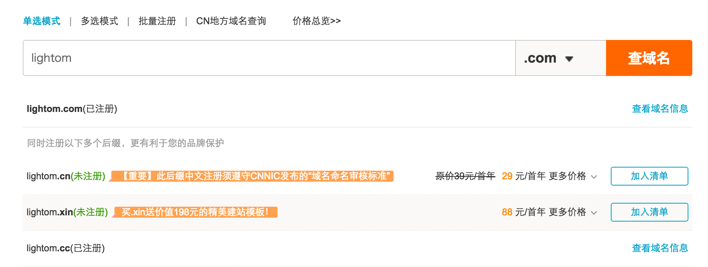

## 目标

花1分钟想想我们的目标：博客，它有自己独立的域名，有一个能存放我们的博客html文件的地方，然后我们也需要一套比较快速且高效的博客框架来迅速搭建我们的博客，让我们能很方便的排版布局，发布内容，定义样式甚至是切换主题。

基于以上需求，业界已经有非常成熟的解决方案了：Hexo+Github Pages

接下来，跟着tom一起，step by step无门槛的完成搭建博客之旅吧。
<!--more-->
## 步骤
1. 用Hexo搭建本地博客
2. 把本地博客部署到github
3. 购买域名，把域名绑定到github
4. 自定义Hexo主题和排版布局
5. 发表文章
6. 洗洗睡觉

## Step 1 用Hexo搭建本地博客

我们的第一步是在电脑上搭建一个本地的博客，并通过浏览器预览。

完成这个工作，全靠[Hexo](https://hexo.io/zh-cn/)这个快速、简洁且高效的博客框架。

Hexo基于nodejs，所以要确保自己已经安装了[node](http://nodejs.cn/)

通过以下命令行安装Hexo
```{bash}
$ npm install hexo-cli -g     #安装hexo
$ hexo init blog              #创建blog文件夹，并初始化
$ cd blog
$ npm install                 #安装相关依赖库
$ hexo server                 #启动本地服务器，这样我们就能在本地通过浏览器访问博客了
```

用浏览器打开[http://0.0.0.0:4000/](http://0.0.0.0:4000/)即可看到我们搭建起来的博客，五脏六腑一应俱全。

## Step 2 把本地博客部署到github

到此，我们只能在本地浏览我们的博客，我们需要把我们的博客搬到互联网上，让其他人看到它。放到哪里好呢？我们选择了Github Pages。它本用于介绍托管在github的项目，提供静态站点托管服务。

#### Why Github Pages
这里我引用前人的描述：
1. github pages有300M免费空间，资料自己管理，保存可靠；
2. 学着用 github，享受 github 的便利，上面有很多大牛，眼界会开阔很多；
3. 顺便看看 github 工作原理，最好的团队协作流程；
4. github 是趋势；
5. 你不觉得一个文科生用 github 很 geek 吗？瞬间跻身技术界；
6. 就算 github 被墙了，还可以搬到国内的 gitcafe 中去。

而我比较看重的是：免费、简单方便。

我们首先注册一个[github](https://github.com/)账号，并[创建github pages的仓库](https://pages.github.com/)。

创建成功后，通过域名http://username.github.io，就可以访问我们的github pages。接下来我们的工作就很简单了：把博客的html等文件传到仓库

一个想当然的办法是直接生成博客系统，把public里面的文件通过git命令上传上去。
但是做为一个懒惰的，有追求的程序员，这明显是不标准的做法，Hexo必须得有一键上传的功能。

我们查阅Hexo的[api](https://hexo.io/zh-cn/docs/commands.html)，果然有。

```{bash}
$ hexo deploy       #部署网站
```

但是在运行这个命令之前，我们需要做一些设置：ssh、hexo config
ssh的目的是通过github的验证，毕竟不是所有人都能传文件到我们的github仓库
hexo config的目的是告诉hexo把博客文件传到我们正确的仓库地址。

- 配置github ssh看[这里](http://blog.csdn.net/binyao02123202/article/details/20130891)
- 配置hexo config：
    + 打开你所在博客系统的文件夹，打开根目录下的_config.yml
    + 找关键字deploy
    + 配置相关信息
```{bash}
deploy:
  type: git
  repository: git@github.com:username/username.github.io.git
  branch: master  
```

搞完之后，一键部署博客到github
```{bash}
$ hexo deploy       #部署网站
```

此时的你，打开浏览器，输入http://username.github.io就能看到自己的博客。

## Step 3 购买域名，把域名绑定到github

现在我们的博客地址其实是github的一个二级域名，通过顶级域名访问博客是一个逼格更高的体验。
所以我购买一个域名，并把域名和我们的github pages绑定。访问任何一个域名都会打开我们的博客。

so，让我们买买买
买域名有人推荐[万网](https://wanwang.aliyun.com/)，有人只推荐[godaddy](https://sg.godaddy.com/zh/), 我最后选择了万网，万网的购买体验更好，如果你想要的域名没有了，它会跟你推荐其他后缀或者相近的域名。我当时选的时候com的已经木有了，最后选了cc这个后缀的域名：），支付宝支付，3年54块钱，不贵。


域名有了，接下来就是绑定域名咯。通过配置DNS即可。
1. 添加CNAME文件
在仓库根目录下添加一个CNAM文件，没有后缀名，里面内容为你的域名(如:lightom.cc),不需要添加http/www等前缀。
2. 添加 DNS  Service记录
去[DNSPod](https://www.dnspod.cn/)注册个账号，添加域名，设置两个A记录。分别是@和www，ip地址填上个步骤获取的IP地址。
3. 设置域名的DNS
在相应域名的Custom DNS里，设置DNS service,添加两条记录f1g1ns1.dnspod.net和f1g1ns2.dnspod.net
4. 漫长的等待
要全球解析生效，得等上一会了，也可以先ping一下自己的设置对不对。

此时通过我们自己购买的域名就能够访问我们自己的博客了。是不是有点小成？

## Step 4 自定义Hexo主题和排版布局

接下来就是专心打理博客的时间，我们会对当前博客的主题和排版布局挑三拣四，评头论足，寻找一个高大上、简约不简单的框架。
有牛人利用爬虫系统抓取，统计出最受欢迎的Hexo主题是[nexT](http://theme-next.iissnan.com/)

所以我们直接拿来用

1.下载
```{bash}
$ cd your-hexo-site
$ git clone https://github.com/iissnan/hexo-theme-next themes/next
```
2.修改_config.yml文件
```{bash}
# Extensions
## Plugins: http://hexo.io/plugins/
## Themes: http://hexo.io/themes/
theme: next
```

再次刷新后就能看到新的主题了。

我们需要花一些时间[配置主题](http://theme-next.iissnan.com/getting-started.html)，包括语言、菜单、侧栏、头像等。
还可以增加第三方服务，比如评论、统计等等。

配置主题的过程中会遇到一些配置问题，可以看[这里](https://github.com/iissnan/hexo-theme-next/wiki)。

## Step 5 发表文章

现在美美的博客框架已经准备就绪，只差东风（文章）了。

发布文章：
```{bash}
$ hexo new [layout] <title>      #发表文章
```

此时我们可以在source/_posts文件夹下面看到一个title.md的文件夹，通过markdown来编辑文章
```{bash}
---
title: Hello World              #文章标题
date: 2016-04-27 11:47:51       #创建时间
tags: 初衷                      #标签
categories: 生活                #分类
---
content                         #文章内容
```

文章写完后，通过如下命令发布：
```{bash}
$ hexo generate
$ hexo deploy
```

over！！！不需要写一行代码，分分钟构建一个高大上的博客系统，是不是屌屌的？赶紧去试试。