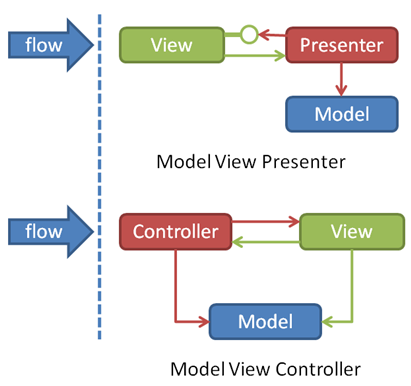
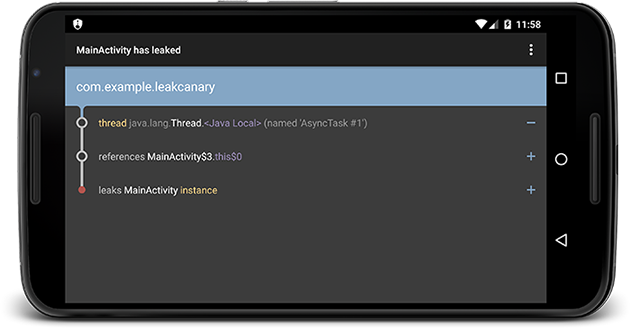

打个广告：**云校园是什么？**

[云校园](http://www.yunxiaoyuan.com/)，作为拓维教育云平台中主打7-18岁教育阶段的一款教育产品，围绕学校、老师、家长、学生四个角色，打造精细化教学管理及校园高价值信息收集分发平台，同时运用本地化家长社区为家长提供海量教育资讯，并为学生提供具有丰富优质学习资源的个性化学习空间，合力构建K12家校共育平台。


云校园经历了2年的发展，从最初1.0到现在的5.0版本。App包含功能插件、家校互通、社区、资讯、学习资源、支付、推送、统计等各种功能和模块。

客户端的技术架构也随业务发展演进到现在。让我们开始吧。

<!--more-->

## 技术选型

1、**通用框架**
搭建云校园1.0的时候，从零起步，安卓开发只有2人，为了提高开发效率，我们想选一个通用的安卓开发框架。

当时较好的框架有AFinal、XUtils等。

我们最后选择了XUtils，因为XUtils基于AFinal，包含了很多实用工具，稳定性也提高了不少。

XUtils主要包括4大模块：
- DbUtils：提供了对象关系映射（ORM）数据库的功能，可以方便的进行对象存储
- ViewUtils：通过注解方式进行UI，资源和事件绑定。可以减少代码量，较少的代码量意味着更少的Bug和更高的开发效率
- HttpUtils：封装了网络请求模块，相比系统组件HttpClient和HttpUrlConnection更好用
- BitmapUtils：较好的图片加载模块，对图片下载和存储统一管理
	
在云校园最开始，XUtils确实发挥了较好的作用，提高了开发效率。这个框架的特点是，功能很全。这是它的优点，同时也是它的缺点。就好像什么都做，但是什么都做不好一样。

所以，我们后来引入了其他的框架替代了XUtils。DB模块被ormLite替代，View模块被Butterknife替代，Http被Volley替代，Bitmap模块被ImageLoader替代。替换上的每个框架都是该领域的佼佼者，更好更专业的完成了各自领域的工作。

2、**ORM框架**
ORM的英文是Object Relation Mapping，也就是对象关系映射，它是一种程序技术，用于实现面向对象编程语言里不同类型系统的数据之间的转换。

我举一个直观的例子，存储一个Book对象到数据库：
```
Book book = new Book("good");
book.setIndex(1988);
book.setAuthor("hehe");
liteOrm.save(book);
```

优点：隐藏了数据访问的细节，将通用数据库的操作封装起来，程序员不用写SQL语句，能把更多的精力放到业务逻辑上去。同时ORM跟具体数据库解耦，也能很方便的替换数据库。
缺点：牺牲了性能，也不能做SQL优化，有一定的学习成本，而且处理复杂的查询力不从心。

ORM框架已经有很多了，比如OrmLite、SugarORM、GreenDAO、Realm。
OrmLite是Java的Orm框架，Android当然能用了。
SugarORM是Android平台专用框架，提供简单易学的API，上手很快。
GreenDAO适用于对性能要求高情况，而且SDK包不到100K。
Realm是一个跨平台、高性能的框架，支持IOS。

最后我们选择了老牌的OrmLite，考虑的是集成方便，上手快，而且稳定性不错。现在Ormlite一直沿用至今，反响不错。

3、**依赖注入框架**
DI（依赖注入）其实是一种设计模式，现在已经被频繁的应用到安卓开发中。
它能够让开发者编写出低耦合的代码，而且更容易测试。

我们首先看看依赖注入的直观感受：
```
class ExampleActivity extends Activity {
  
  @BindView(R.id.user) EditText username;
  @BindView(R.id.pass) EditText password;
  @BindString(R.string.login_error) String loginErrorMessage;
  
  @OnClick(R.id.submit) void submit() {
    // TODO call server...
  }

  @Override public void onCreate(Bundle savedInstanceState) {
    super.onCreate(savedInstanceState);
    setContentView(R.layout.simple_activity);
    ButterKnife.bind(this);
    // TODO Use fields...
  }
}
```

云校园的依赖注入框架由最开始的XUtils，换成了AndroidAnnotations，最后又替换成ButterKnife和Dagger2。

Butterknife针对Android平台，提供了View，资源，事件回调等注入。非常方便、易懂。
而Dagger2可以注入各种组件，配合Activity生命周期管理组件生命周期。是MVP模式（后面会讲）的天然搭档。
基于这两款框架，我们降低了20%的代码量，而且代码的耦合性很低。

4、**网络模块框架**
网络模块必不可少。

Android系统提供了HttpClient和HttpUrlConnection。HttpClient是Apache的开源实现，而HttpUrlConnection是Android2.2之后的标准实现，而且是官方推荐的。虽然HttpUrlConnection做了不少封装但是还是不好用。

随着Android的流行，出现了很多优秀的网络模块框架。
比如：android-async-http、Okhttp、Retrofit、Volley。

Retrofit提供了非常好的RESTful封装和解耦，而且支持rx编程。

async-http能很好的完成了网络的异步请求与回调，而且HTTP请求发生在UI线程之外。

但是Volley对网络的封装得很好。
我们采用Volley，通过自定义Request，我们用面向对象的方式封装了各个网络请求业务。
BaseRequest进行统一的公共的参数处理、错误处理、公共的返回处理。
外部请求传入较少的参数，只需要考虑业务逻辑。

引入Volley之初，Volley的底层使用的是Android系统组件：HttpClient+HttpURLConnection，后来发现，OkHttp使用NIO更加高效，于是我们也将Volley的底层切换为OkHttp。

对于协议层，我们没有采用Json，而是用的Thrift。
Thrift作为跨语言RPC框架有很多优点，相比json，序列化之后的传输小了不少，而且安全性更高。
另外Thrift还有一个很好的特点：协议结构清晰，而且有很好的扩展性。

5、**图片加载框架**
云校园有大量的图片显示需求，而图片这块涉及到下载，缓存，异步加载，图片处理，OOM等问题。特别是OOM这块，图片占用了应用大量内存，如果内存管理不好，很容易出现内存溢出，导致应用稳定性问题。

云校园的图片加载框架从早期的XUtils切换到ImageLoader，满足了基本的需求。但是ImageLoader的作者已经不再维护这个框架了。我们开始调研新的图片加载框架。

Picasso比较轻量，但是Glide的默认参数配置更好。

因为每个图片加载框架的区别很大，为了防止迁移和切换带来很大的工作量，我们提取了自己的图片加载组件ImageManager，作为图片加载框架的适配器。保证了这块的解耦。

Fresco在4.4及以下版本使用匿名内存来作为内存缓存，能极大的减少OOM。但是缺点是包很大。

综合考虑后，我们选择了Google官方的Glide加载框架。

## 架构

1、**解耦**
问题：在Activity及各个组件之间进行事件传递，大家会用什么方式？
Intent？Handler？BroadCastReceiver？Callback？
这些都不是好的解决方案。
EventBus却用一种优雅的方式，一种松耦合的方式解决这个问题。

我们看一个直观的例子：
```
//A组件内发送事件
eventBus.post(new AnyEventType());

//B组件内接受事件
@Subscribe  
public void onEvent(AnyEventType event) {/* Do something */};
```

怎么样？是不是迫不及待的想用起来，解决项目里面无处不在的Handler传递？
引入EventBus后，每个组件之间的耦合性降低了很多，统一的事件分发管理也让业务逻辑清晰简单。

2、**架构模式MVP**
MVP模式相比传统的MVC模式，一般大家普遍的认识都是：“MVC的演化版本”、“让Model和View完全解耦”、“代码很清晰，不过增加了很多类”。

MVP模式的一个核心点是Model和View不会直接交互，而是由Presenter完成。



我们在项目中引入MVP模式的一个主要原因是：Activity既当View，又当Controller，导致Activity内部代码庞大，而引入MVP后，Activity只作为View，Controller负责的业务逻辑被封装到了Presenter里面，代码更为清晰。

在项目中，复杂的需求我们会优先采用MVP模式。

3、**响应式编程(RX)**
响应式编程是一种面向数据流和变化传播的编程方式。
利用响应式编程，我们可以加深代码抽象的程度，可以很好的解决Callback Hell的问题，而且在线程切换问题上易如反掌。

给大家一个直观的例子：

假设有这样一个需求：
界面上有一个自定义的视图imageCollectorView，它的作用是显示多张图片。现在需要程序将一个目录中每个目录下的png图片都加载出来并显示在imageCollectorView中。
你会怎么做？（注意：由于读取图片的程较为耗时，需要放在后台线程执行，而图片的显示则必须在UI线程执行。）

通常做法(Callback Hell)：
```
new Thread() {
    @Override
    public void run() {
        super.run();
        for (File folder : folders) {
            File[] files = folder.listFiles();
            for (File file : files) {
                if (file.getName().endsWith(".png")) {
                    final Bitmap bitmap = getBitmapFromFile(file);
                    getActivity().runOnUiThread(new Runnable() {
                        @Override
                        public void run() {
                            imageCollectorView.addImage(bitmap);
                        }
                    });
                }
            }
        }
    }}.start();
```

RX做法：
```
Observable.from(folders)
    .flatMap((Func1) (folder) -> { Observable.from(file.listFiles()) })
    .filter((Func1) (file) -> { file.getName().endsWith(".png") })
    .map((Func1) (file) -> { getBitmapFromFile(file) })
    .subscribeOn(Schedulers.io())
    .observeOn(AndroidSchedulers.mainThread())
    .subscribe((Action1) (bitmap) -> { imageCollectorView.addImage(bitmap) });
```

基于事件流，已经没有烦人的回调嵌套了，每一步业务逻辑都非常清晰：读目录->读PNG文件->转成Bitmap->显示图片。

这样的代码，真是让bug无处藏身呀！！！

而且Rx有很多周边组件可以用，比如rxlifecycle，把Activity生命周期和Rx事件流绑定，当Activity销毁的时候，可以自动解绑事件流。避免了内存泄漏。

## 开发者服务

现在的移动应用开发环境已经很成熟了，有很多不错的开发者服务能够帮助开发者快速开发。

比如：
- 应用统计：友盟统计、fabric
- 推送：信鸽、个推
- IM：腾讯云、环信
- 分享：ShareSDK、友盟分享
- Crash上报：Crashlytics、Bugly、BugTags
- 云存储：阿里OSS、七牛云存储
- 自动更新：友盟更新、讯飞
- 用户反馈：友盟反馈
- 应用分发：蒲公英、fir.im

基于这些基础服务，开发者可以把主要精力放在业务逻辑上，做到快速开发。

## 其他

1、**统一Style和主题**

我们发现在写UI界面的时候，每个View控件为了做到高质量的UI还原，需要为每个控件写很多属性。而且很多属性不停的重复。

写代码最基本的几个原则是要避免重复代码，如果出现超过2次，就应该提取。

所以针对上述情况，我们针对每种控件，抽取出公共的style属性来。

在写界面的时候，直接使用：

```
<TextView
    android:id="@+id/title_textview"
    style="@style/Text.Title"
    android:text="@string/no_login_tip_title"
    />
```

这样做的好处是：
- 代码量少
- 调整UI非常方便，且很容易做主题
- 形成了一整套风格统一的UI，**规范了程序员和设计师**

2、**工具类**

很多有用的工具可以帮助程序员。

- leakcanary，用来查应用的内存泄漏


- facebook出品的stetho，用来调试Android应用。包括：查看App的布局，网络请求，sqlite，preference，一切都是可视化的操作。


- 持续集成
应用的持续集成，自动化的发布版本，能更敏捷的让产品经理体验需求。而Jenkins无疑是首选。
Jenkins是免费的持续集成工具，云校园利用Jenkins，定时拉取代码，编译，打包，并上传到分发平台-蒲公英，并发送邮件。非常完美的完成了持续集成的工作。


## 总结
Android的开发环境越来越成熟，作为一个开发者，我们不能故步自封，要跟随着发展趋势，站在“巨人”的肩膀上，最大限度的利用新技术和服务，应用到项目中，解决实际问题。

要记住，能偷懒的程序员，才是好程序员。

